# <p align="center">Mehmet Akif Özdemir Staj - React</p>

## Contents
- [Getting Started](#getting-started)
  * [Installation](#installation)
- [Used Technologies](#used-technologies)
- [Screen Shouts](#screen-shots)

## Getting Started

### Installation

1. Clone the repo:

   ```sh
   git clone https://github.com/akifz21/FullStackProductCatalogProject.git
   ```
2. Open the `client` folder with `Visual Studio Code`
3. Open the `ApiUrl.js` file in the folder `src/api` and enter your server running port(Default https://localhost:7086/ )
4. Run the following commands:

   ```sh
   npm install
   ```
   then
   
   ```sh
   npm start
   ```
6. Client is ready and running!
7. `NOTE:`
    Client must run on port https://localhost:3000/, Server allowing the cors to port https://localhost:3000/. Or Open the `Program.cs` file in the folder `server/WebApi/` and you can allow the cors to your current running port.
8. `NOTE:` 
    Owner account of default products email=akif@ozdemir.com password=12345678

## Used Technologies
| Technology / Library | Version |
| ------------- | ------------- |
| react |18.2.0 |
| axios | 0.27.2 |
| bootstrap | 5.2.0 |
| formik | 2.2.9 |
| jwt-decode | 3.1.2 |
| react-bootstrap | 2.4.0 |
| react-dom | 18.2.0 |
| react-router-dom | 6.3.0 |
| react-scripts |5.0.1 |
| react-toastify | 9.0.7 |
| yup | 0.32.11 |
| web-vitals | 2.1.4 |

## Screen Shots

**Home**
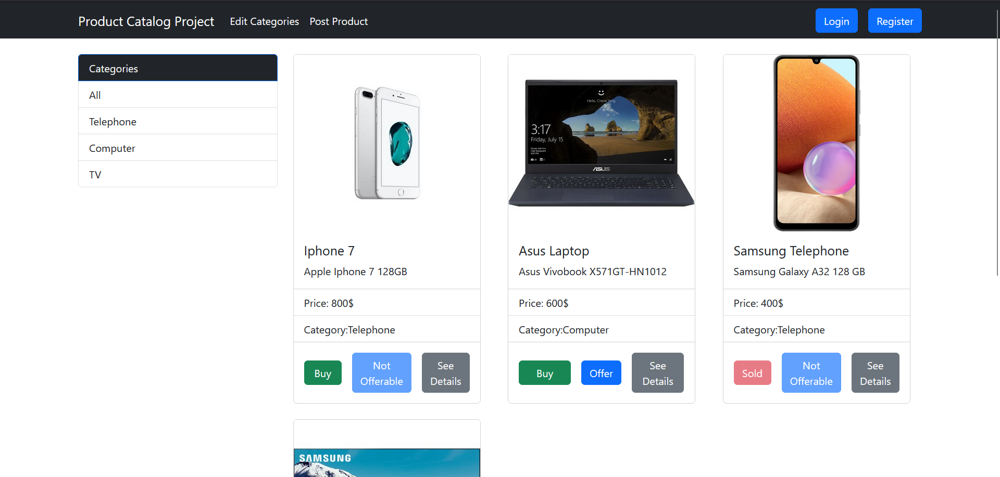

**Login**
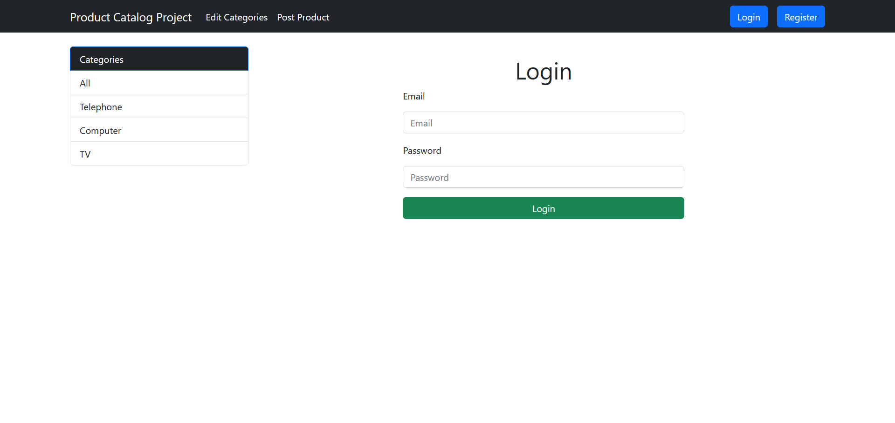

**Register**
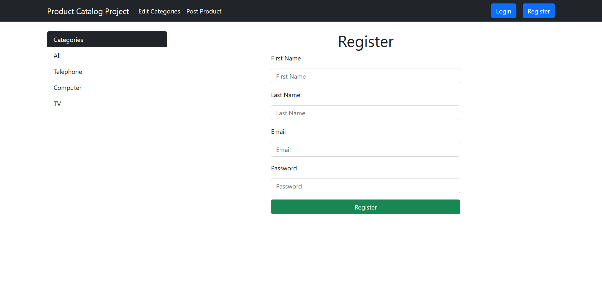

**Add Product**
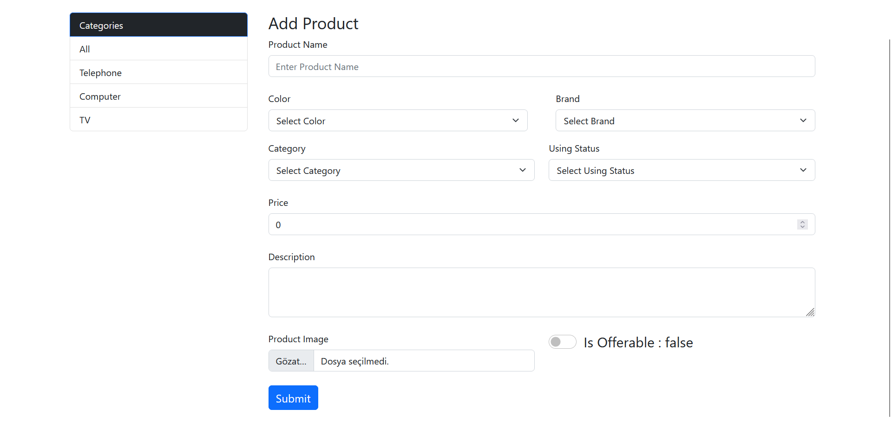

**Product Details**
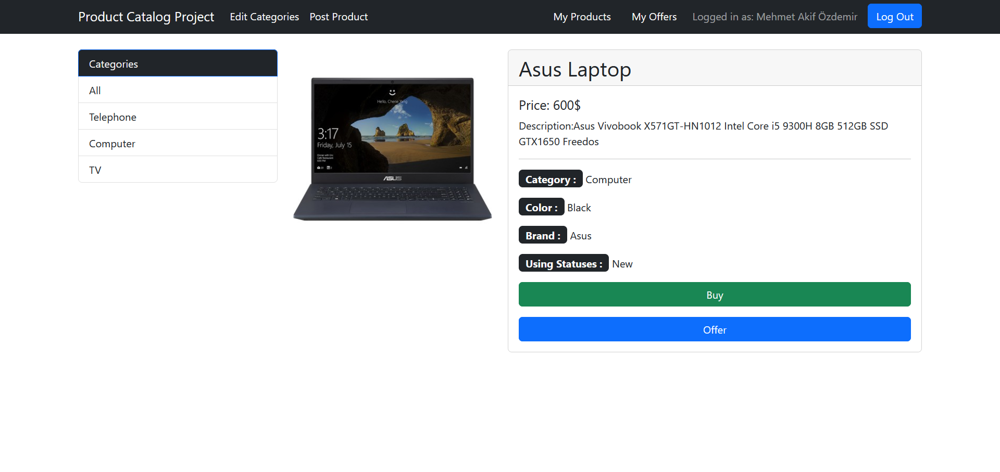

**User's Products**
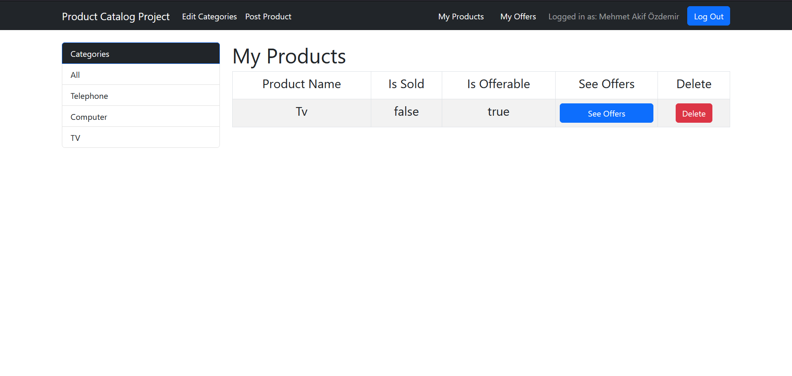

**Product's Offers**


**Offer To Product**
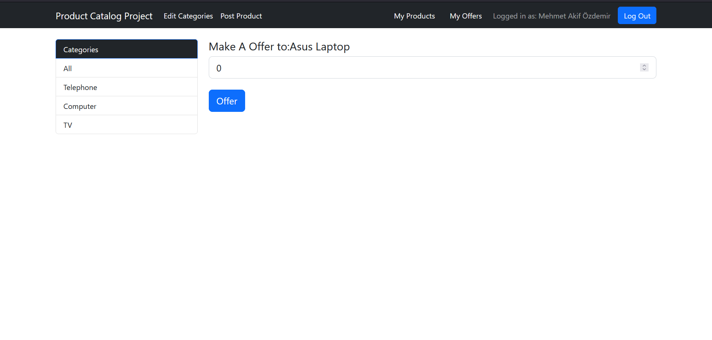

**Offer To Product With Percent**
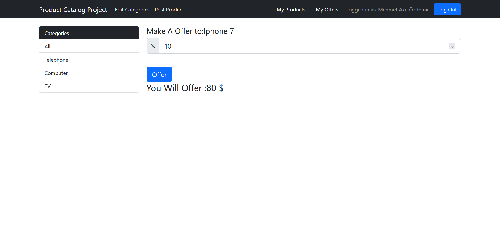

**Waiting Offer**
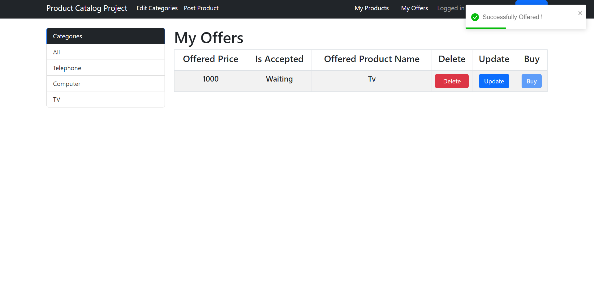

**Accepted Offer**
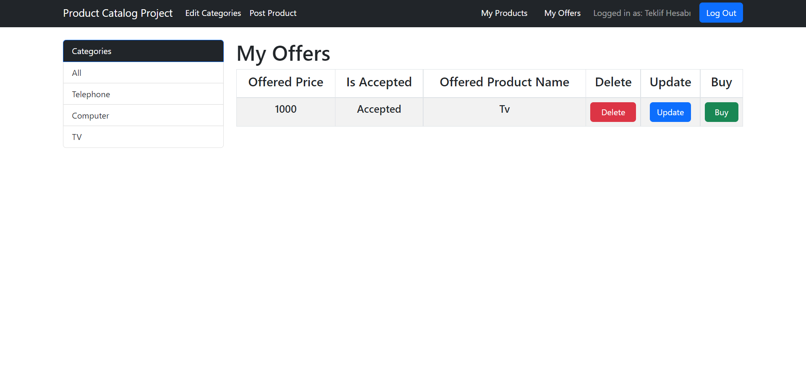

**Categories**
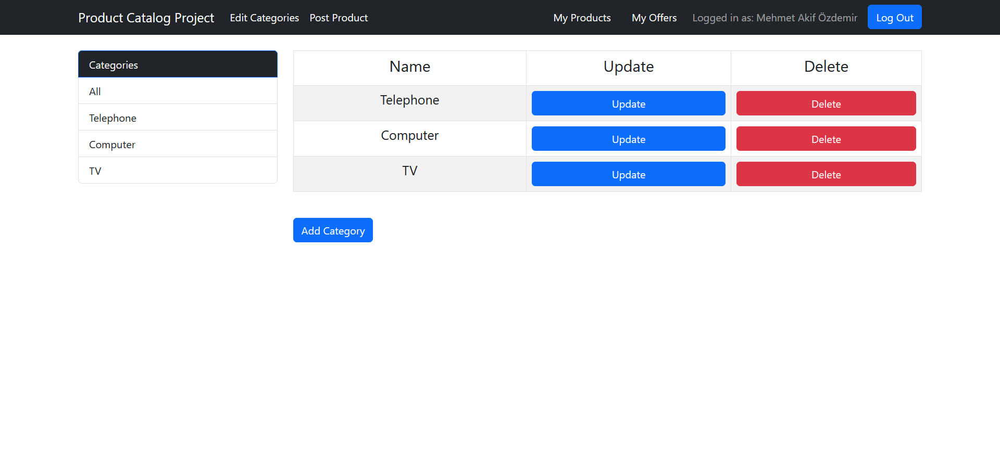

**Private Page**
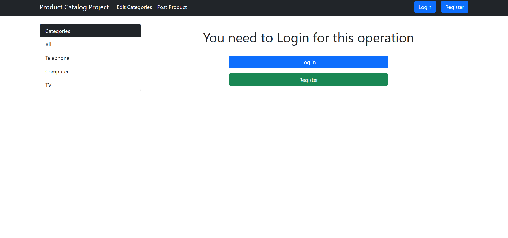
