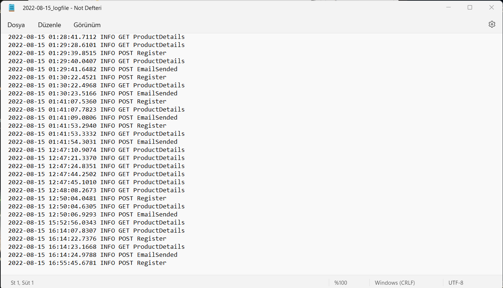
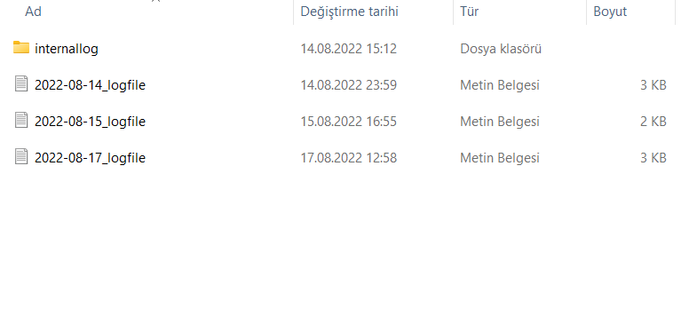
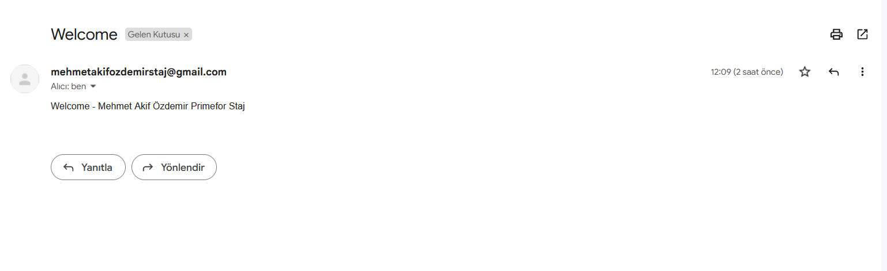
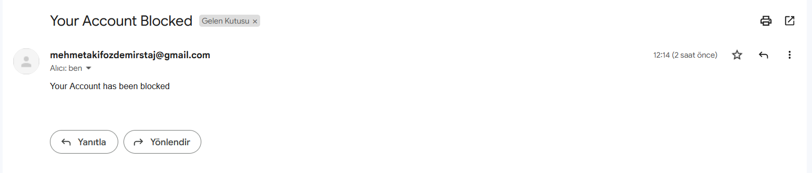
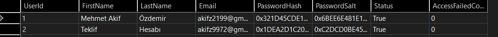
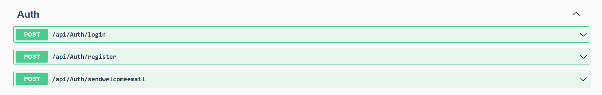
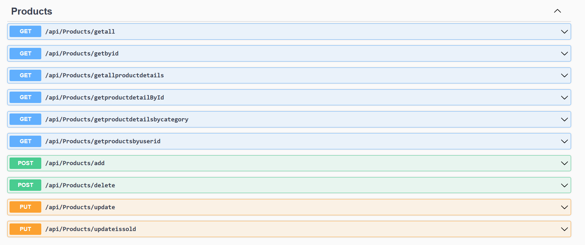
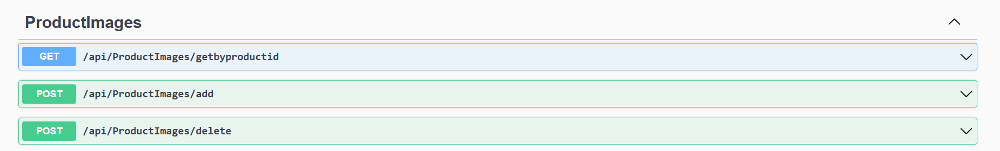
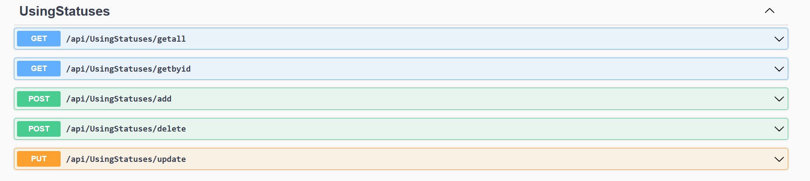

# <p align="center">Mehmet Akif Özdemir Staj - Backend</p>

## Contents
- [Getting Started](#getting-started)
  * [Installation](#installation)
  * [Usage](#usage)
- [Tech Stack](#tech-stack)
- [Swagger](#swagger)

## Getting Started

### Installation

1. Clone the repo:

   ```sh
   git clone https://github.com/akifz21/FullStackProductCatalogProject.git
   ```
2. Open the `ProductCatalogProject.sln` file in the `server` folder with `Visual Studio`
3. Open the `appsettings.json` file in the `WebApi` folder and enter your own database connection string
4. Open `Package Manager Console - Default Project: DataAccess` and run the following commands for migrate database:

   ```sh
   update-database
   ```
   `NOTE:`
   ```sh
    Or Migrates automatically when you start the project
   ```
   
5. Right click on the `WebAPI` project (layer) from the `Solution Explorer` and select `Set as Startup Project` 
6. Start the project with `WebApi` in Visual Studio. Web API is ready and running!
8. `NOTE:` 
    Owner account of default products email=akif@ozdemir.com password=12345678

### Usage
 
After running the Web API, you can make HTTP requests like:
   
   ```sh
   https://localhost:7086/api/`CONTROLLER_NAME`/`METHOD_NAME`
   ```
 
   `CONTROLLER_NAME` => Each .cs file located in the `WebAPI.Controllers` folder (For example CONTROLLER_NAME for `ProductsController`: Products )
   <br><br>
   `METHOD_NAME` => All of the methods in each .cs file in the `WebAPI.Controllers` folder
 
#### Sample HTTP GET requests:

1. List all Products:
   ```sh
   https://localhost:7086/api/Products/getall
   ```
2. List a brand by id:
   ```sh
   https://localhost:7086/api/brands/getbyid?id=3
   ```
3. List all Product colors:
   ```sh
   https://localhost:7086/api/colors/getall
   ```

## Tech Stack
| Technology / Library | Version |
| ------------- | ------------- |
| .NET | 6.0 |
| Autofac | 6.4.0 |
| Autofac.Extensions.DependencyInjection | 8.0.0 |
| Autofac.Extras.DynamicProxy | 6.0.1 |
| FluentValidation | 11.1.0 |
| Microsoft.AspNetCore.Authentication.JwtBearer | 6.0.7 |
| Microsoft.AspNetCore.Http | 2.2.2 |
| Microsoft.AspNetCore.Http.Abstractions | 2.2.0 |
| Microsoft.AspNetCore.Features | 5.0.17 |
| Microsoft.EntityFrameworkCore | 6.0.7 |
| Microsoft.EntityFrameworkCore.Tools | 6.0.7 |
| Microsoft.EntityFrameworkCore.Design | 6.0.7 |
| Microsoft.EntityFrameworkCore.InMemory | 6.0.7 |
| Microsoft.EntityFrameworkCore.SqlServer | 6.0.7 |
| Microsoft.Extensions.Configuration | 6.0.1 |
| Microsoft.Extensions.Configuration.Json | 6.0.1 |
| Microsoft.Extensions.Configuration.Binder | 6.0.0 |
| Microsoft.Extensions.DependencyInjection.Json | 6.0.0 |
| Microsoft.IdentityModel.Tokens | 6.12.2 |
| System.IdentityModel.Tokens.Jwt | 6.12.2 |
| MimeKit | 3.3.0 |
| NLog | 5.0.2 |
| NLog.Extensions.Logging | 5.0.2 |
| Swashbuckle.AspNetCore | 6.2.3 |

## Services
- Users can register and login to system using JWT
- Users can post Product with ProductImage
- Users can Offer to other Products
- Users can view their own added products and own Offers
- Users can see offers for their own products
- Users can accept offers for their own products
- Users can buy product with accepted offer
- Saving user passwords to database using hash and salt
- User can buy product without offer
- Not authorized Users can not post product,make offer etc. 
- Users can select Color,Brand,Category ; they can add ProductName,ProductImage,Price and they can choose to offerable or not 
- Used EntityFramework, GenericRepository and RepositoryPattern
- Added Private Routes
- Added Validations
- Added email service,Email is sent when user registers
- Added file type validation and file size limit
- Added NLog file logger
- Added user blocking after entering wrong password 3 times

## Nlog file logger
1. 
2. 

## Email
1. 
2. 

## Password Salt&Hash
1. 

## Swagger
**Auth**


**Products**


**Brands**


**Colors**


**Offers**


**ProductImages**


**Using Statutes**



